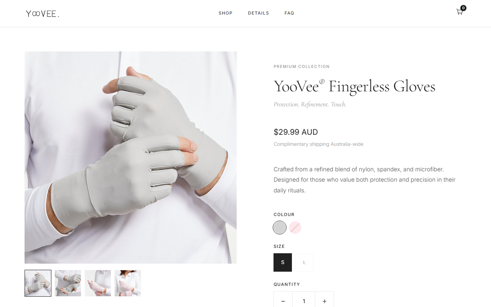

# YooVee® Premium Fingerless Gloves - E-commerce Website



A modern, responsive single-product e-commerce website for YooVee® Premium Fingerless Gloves, featuring a Node.js backend for Stripe payment processing.

**Live Site:** [https://yoovee.com.au](https://yoovee.com.au)

## Overview

This project is a sophisticated, modern e-commerce website for YooVee® fingerless gloves that combines elegant aesthetics with robust functionality. The single-product store focuses on showcasing premium fingerless gloves while guiding visitors through a seamless shopping experience, including secure online payments via Stripe.

## Recent Updates - January 2026

### Minimalist Scandinavian Redesign
- **Complete Visual Overhaul:** Clean, elegant aesthetic inspired by Scandinavian design principles
- **Neutral Color Palette:** Soft whites, warm grays, and subtle accent colors
- **Typography Refresh:** Modern, refined typography for improved readability
- **Streamlined Layout:** Focused product presentation with generous whitespace
- **Premium Feel:** Design language that reflects the quality of the product

### Mobile-First Navigation
- **App-Like Taskbar:** Bottom navigation with glass morphism effect
- **Smart Scroll Interactions:** Scroll-based active states and progress indicator
- **Sticky Add-to-Cart:** Mobile-optimized floating add-to-cart bar
- **Responsive Design:** Seamless experience across all devices

### Social Proof & Trust Elements
- **Customer Reviews:** Authentic testimonials from verified Australian customers
- **Trust Badges:** Free Shipping, 30-Day Returns, Secure Checkout, Australian Owned
- **Sales Counter:** Dynamic social proof indicators

### Performance Optimizations
- **Mobile-Optimized:** Reduced motion for better performance on smaller devices
- **Efficient Animations:** Hardware-accelerated transforms for smooth 60fps interactions
- **Smart Loading:** Optimized resource delivery for faster page load times

## Features

### Frontend
- **Responsive Design:** Mobile-first layout optimized for all devices
- **Scandinavian UI:** Minimalist aesthetic with neutral tones and generous whitespace
- **Product Gallery:** Interactive gallery with thumbnails, navigation arrows, and zoom modal
- **Shopping Cart:** Persistent cart using localStorage
- **Accessibility:** Full ARIA support, keyboard navigation, semantic HTML

### E-commerce
- **Secure Checkout:** Stripe Payment Element integration
- **Trust Signals:** Trust badges, payment icons, social proof
- **Newsletter Signup:** Email capture with discount incentive
- **Multi-currency:** Configured for AUD

### SEO & Performance
- **Structured Data:** JSON-LD schemas (Product, Organization, FAQPage, WebSite)
- **SEO Optimized:** robots.txt, sitemap.xml, meta tags, Open Graph
- **Performance:** Resource preloading, lazy loading, preconnect hints
- **Analytics Ready:** Google Analytics 4 placeholder included

## Project Structure

```
yoovee-store/
├── index.html              # Main landing/product page
├── cart.html               # Shopping cart with Stripe checkout
├── payment-success.html    # Post-payment confirmation
├── server.js               # Express backend for Stripe
├── robots.txt              # Search engine directives
├── sitemap.xml             # XML sitemap with images
├── package.json            # Node.js dependencies
│
├── css/
│   ├── style.css           # Main stylesheet (2000+ lines)
│   └── cart.css            # Cart-specific styles
│
├── js/
│   ├── main.js             # Navigation, accordions, modals
│   ├── product.js          # Gallery, color/size selection
│   ├── cart.js             # Cart management, localStorage
│   ├── checkout.js         # Stripe checkout flow
│   ├── carousel.js         # Image carousel
│   └── image-modal.js      # Product image zoom
│
├── images/
│   ├── Product/            # Product photos (jpg, webp)
│   ├── svg/                # Patterns and logos
│   ├── favicon.png
│   └── logo-header-transparent.svg
│
└── docs/
    └── AI-IMAGE-GENERATION-GUIDE.md  # Guide for AI product photography
```

## Technology Stack

### Frontend
| Technology | Purpose |
|------------|---------|
| HTML5 | Semantic structure with ARIA |
| CSS3 | Flexbox, Grid, CSS Variables |
| JavaScript ES6+ | Modular, no framework dependencies |
| Font Awesome 6 | Icons |
| Google Fonts | Montserrat typography |

### Backend
| Technology | Purpose |
|------------|---------|
| Node.js | Runtime |
| Express.js | HTTP server |
| Stripe API | Payment processing |
| dotenv | Environment variables |
| cors | Cross-origin requests |

### SEO & Analytics
| Feature | Implementation |
|---------|----------------|
| Structured Data | JSON-LD (Product, FAQ, Organization) |
| Meta Tags | Open Graph, Twitter Cards |
| Sitemap | XML with image extensions |
| Analytics | Google Analytics 4 ready |

## Getting Started

### Prerequisites
- Node.js 16+ and npm
- Stripe account with API keys
- (Optional) Google Analytics 4 Measurement ID

### Installation

1. **Clone the repository:**
   ```bash
   git clone https://github.com/m4cd4r4/yoovee-store.git
   cd yoovee-store
   ```

2. **Install dependencies:**
   ```bash
   npm install
   ```

3. **Configure environment:**
   Create `.env` in root:
   ```env
   STRIPE_SECRET_KEY=sk_test_your_stripe_secret_key
   PORT=4242
   ```

4. **Configure Google Analytics (optional):**
   In `index.html`, replace `G-XXXXXXXXXX` with your GA4 Measurement ID.

5. **Start the server:**
   ```bash
   npm start
   ```
   Server runs at http://localhost:4242

6. **Open the site:**
   Open `index.html` in your browser, or serve with a local server.

## Configuration

### Stripe Setup
1. Get your API keys from [Stripe Dashboard](https://dashboard.stripe.com/apikeys)
2. Add Secret Key to `.env`
3. The Publishable Key is already in `cart.html` (test mode)

### Google Analytics
Replace the placeholder in `index.html`:
```html
<script async src="https://www.googletagmanager.com/gtag/js?id=G-YOUR-ID"></script>
```

### Product Details
Update product info in:
- `index.html` (display content)
- JSON-LD schema in `<head>` (structured data)
- `sitemap.xml` (image URLs)

## Key Components

### Trust & Conversion Elements
- **Hero Social Proof:** Star rating and customer count
- **Trust Badges:** Free Shipping, 30-Day Returns, Secure Checkout, Australian Owned
- **Payment Icons:** Visa, Mastercard, Amex, PayPal, Stripe
- **Newsletter:** 10% discount incentive with email capture

### SEO Features
- **Product Schema:** Price, availability, ratings, shipping, returns
- **FAQ Schema:** Enables rich snippets in search results
- **Organization Schema:** Brand information
- **Open Graph:** Optimized social sharing

### Accessibility
- Full keyboard navigation
- ARIA labels and roles
- Focus states on all interactive elements
- Screen reader friendly

## Documentation

Additional documentation available in `/docs`:
- **[AI Image Generation Guide](docs/AI-IMAGE-GENERATION-GUIDE.md)** - Comprehensive guide for creating product lifestyle images using AI tools (FLUX, Stable Diffusion, ComfyUI)

## Browser Support

| Browser | Support |
|---------|---------|
| Chrome | Full |
| Firefox | Full |
| Safari | Full |
| Edge | Full |
| Mobile browsers | Full |

## Deployment

This project is deployed on **Vercel** with automatic deployments from the `main` branch.

### Production Setup
- **Hosting:** [Vercel](https://vercel.com) (free tier)
- **Domain:** yoovee.com.au (registered at CrazyDomains)
- **Branch:** `main` (production)
- **Auto-deploy:** Every push to `main` triggers automatic deployment

### Deploy Your Own
1. Fork this repository
2. Import to Vercel: [vercel.com/import](https://vercel.com/import)
3. Configure environment variables for Stripe
4. Add your custom domain

### Alternative Hosting
The frontend can be deployed to any static host (Netlify, GitHub Pages, etc.). The Stripe backend requires a Node.js server or serverless functions.

## Security Notes

- Never commit `.env` file
- Use Stripe test keys for development
- The Publishable Key in `cart.html` is safe to expose (it's meant to be public)
- Always use HTTPS in production

## License

All rights reserved. YooVee® is a registered trademark.

---

**Australian Owned & Operated**
